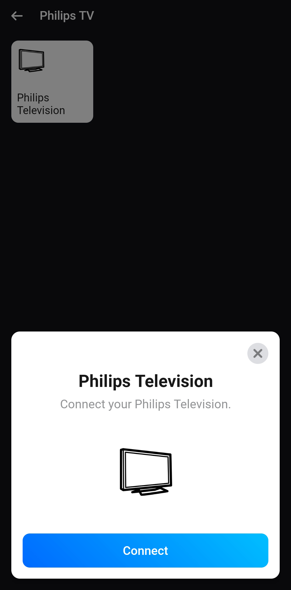
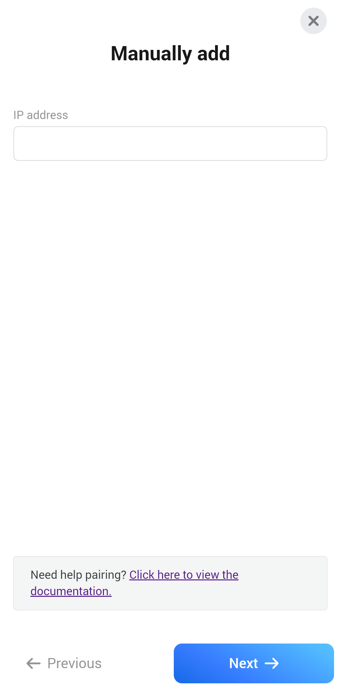

# Pairing

Here, we will guide you through the pairing process for adding a device to your Homey.&#x20;

We'll cover everything from device discovery to successful pairing, and provide troubleshooting tips along the way. So, let's get started! The following chapters will take you through the process step by step:

* [Device discovery](pairing.md#device-discovery)
  * [Device already found](pairing.md#device-already-found)
* [Manually add your device](pairing.md#manually-add-your-device)
* [Pincode authentication](pairing.md#pincode-authentication)
  * [Pincode errors](pairing.md#pincode-errors)
* [Device successfully added](pairing.md#device-successfully-added)

Start the pairing process.

## Device discovery

If your Philips TV device is compatible and available on your network, it can be automatically discovered by the Homey Philips TV app using Simple Service Discovery Protocol (SSDP). In this case, the Homey app will display all devices that are found and prompt you to select one to add.


You can only add one device at a time


That's it for the device discovery! If your device requires authentication, you'll automatically be presented with the pincode authentication screen. [In the next section](pairing.md#pincode-authentication), we'll walk you through the pincode authentication process step-by-step.

### Device already found

If all devices that are discovered by the Homey Philips TV app have already been added, you will be presented with the screen below indicating that no new devices were found. In this case, you can manually add your device or exit the discovery process.&#x20;

To manually add your device, please refer to the next section of this guide.

## Manually add your device

If your device cannot be automatically found via SSDP, don't worry, you still have the option to manually add your device by its IP address.


Make sure your tv is turned on and that it's on the same network as your Homey


There may be instances where the app is unable to reach your device on the IP address you provided, or it is unable to find the Jointspace endpoint on your device. In such cases, you will be presented with the following screen which explains the issue and provides some context and troubleshooting suggestions.

That's it for manually adding your device! If your device requires authentication, you'll automatically be presented with the pincode authentication screen. [In the next section](pairing.md#pincode-authentication), we'll walk you through the pincode authentication process step-by-step.

## Pincode authentication

In order to successfully pair your device with the Homey Philips TV app, you might need to authenticate it with a pincode. This is necessary if the app has successfully read your device's details and it can confirm that it requires authentication.&#x20;

Once the pairing sequence has been initiated, a pincode will be displayed on your TV for 60 seconds. Below, we'll guide you through the expected behavior and some troubleshooting tips along the way.

If you encounter any issues while entering the pincode, such as entering an incorrect pin or some other issue causing the pincode to not be accepted, you will see the following message on your screen.&#x20;

This could be due to an incorrect pin or a communication issue between your device and the app. If you encounter this message, make sure to double-check the pincode and try again. If the issue persists, try restarting your device or the app.

Finally, once you have successfully entered a pincode that is accepted, your [device will be added](pairing.md#device-successfully-added) to your Homey.

### Pincode errors

This app was created through reverse engineering the Jointspace API, which can make it challenging to account for every model of Philips TV. While the app has been confirmed to work on many models manufactured between \~2014 and 2022, there may still be some models that it does not support.&#x20;

Unfortunately, due to the lack of official documentation and the difficulty of getting in touch with TP Vision (the producer of Philips TVs), it is unlikely that models that don't currently work will ever be supported.&#x20;

If you are sure you entered the correct pincode and the app still gives the "pincode not valid" error, it's most likely that your model is not supported by this app. However, there's also a small change that you may also have encountered a bug.

In either case, we apologize for any inconvenience and encourage you to reach out for further assistance if you are having difficulty.

If you [are able to verify that your TV supports the Jointspace API](pairing.md#how-can-i-verify-myself-if-my-tv-is-supported-by-this-app), please submit a bug report on Github.

<table data-card-size="large" data-view="cards"><thead><tr><th></th><th data-type="content-ref"></th><th data-hidden data-card-target data-type="content-ref"></th><th data-hidden data-card-cover data-type="files"></th></tr></thead><tbody><tr><td>Submit a bug report on Github</td><td><a href="https://github.com/lucasvdh/codes.lucasvdh.philips-jointspace/issues">https://github.com/lucasvdh/codes.lucasvdh.philips-jointspace/issues</a></td><td><a href="https://github.com/lucasvdh/codes.lucasvdh.philips-jointspace/issues">https://github.com/lucasvdh/codes.lucasvdh.philips-jointspace/issues</a></td><td><a href="../.gitbook/assets/github.png">github.png</a></td></tr></tbody></table>

## Device successfully added

If you have followed all the steps in the pairing flow successfully, your device will be added to your Homey. You will be presented with a screen below when your device is being added. Once it has been added you can start using it in your Homey flows. From here on, you can use the condition cards and action cards to set up your flows and start automating your smart home experience.

We hope that this guide has been helpful in assisting you with pairing your device with the Homey Philips TV app. If you have any further questions or suggestions, please do not hesitate to open a support ticket!

<table data-card-size="large" data-view="cards"><thead><tr><th></th><th data-type="content-ref"></th><th data-hidden data-card-target data-type="content-ref"></th><th data-hidden data-card-cover data-type="files"></th></tr></thead><tbody><tr><td>Open support ticket on Github</td><td><a href="https://github.com/lucasvdh/codes.lucasvdh.philips-jointspace/issues">https://github.com/lucasvdh/codes.lucasvdh.philips-jointspace/issues</a></td><td><a href="https://github.com/lucasvdh/codes.lucasvdh.philips-jointspace/issues">https://github.com/lucasvdh/codes.lucasvdh.philips-jointspace/issues</a></td><td><a href="../.gitbook/assets/github.png">github.png</a></td></tr></tbody></table>

##
